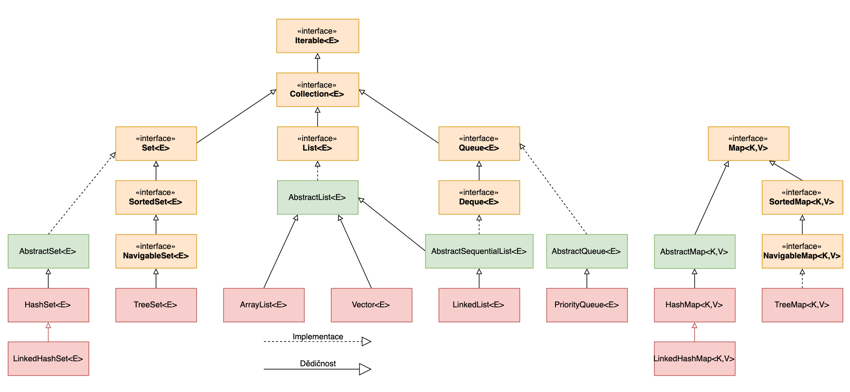

Homework assignment no. 1, Simple Messaging
====================================

**Publication date:**  April 3, 2023

**Submission deadline:** April 17, 2023

## CHANGELOG

* 3.4.2023: Initial version

General information
-------------------
This section provides general information about the initial structure of the provided codebase.  

### Project Structure
The structure of the project provided as a base for your implementation should meet the following criteria.

1. Package ```cz.muni.fi.pb162.hw02``` contains classes and interfaces provided as a part of the assignment.
   - **Do not modify or add any classes or subpackages into this package.**
   - **Interfaces must be implemented**
2. Package  ```cz.muni.fi.pb162.hw02.impl``` should contain your implementation.
- **Anything outside this package will be ignored during evaluation.**


Additionally, the following applies for the initial contents of ``cz.muni.fi.pb162.hw02.impl``

1) The information in **javadoc has precedence over everything**
2) **Interfaces** must be implemented
3) **Interfaces** must keep predefined methods
4) Otherwise, you can modify the code (unless tests are affected) as you see fit
5) When in doubt, **ASK**

**Note:**  
*While a modification of the interface is not strictly prohibited, you don't want to end with [god object](https://en.wikipedia.org/wiki/God_object) implementations.    
On the other hand, you want to adhere to the [single responsibility principle](https://en.wikipedia.org/wiki/Single-responsibility_principle).  
A rule of thumb should be not to modify interfaces unless required by the assignment. Consider extending the interface as an alternative.*

### Names in This Document
Unless fully classified name is provided, all class names are relative to the package ```cz.muni.fi.pb162.hw02``` or ```cz.muni.fi.pb162.hw02.impl``` for classes implemented as a part of your solution.

### Compiling the Project
The project can be compiled and packaged in the same way you already know.

```bash
$ mvn clean install
```

The only difference is that unlike the seminar project, the checks for missing documentation and a style violation will produce an error this time.
You can disable this behavior temporarily when running this command.

```bash
$ mvn clean install -Dcheckstyle.skip
```

You can consult your seminar teacher to help you set the ```checkstyle.skip``` property in your IDE (or just google it).

### Submitting the Assignment
Follow instructions of your tutor because the procedure to submit your solution may differ based on your seminar group. However, there are two ways of submission in general:
* Fork the project, develop your code in a development branch, and finally ask for the merge.
* Submit ```target/homework02-2023-1.0-SNAPSHOT-sources.jar``` to the homework vault.

### Minimal Requirements for Acceptance
- Fulfilling all Java course standards (documentation, conventions, etc.)
- Proper code decomposition
  - Split your code into multiple classes
  - Organize your classes in packages
- Single responsibility
  - Class should ideally have a single purpose
- Extendable code
- All provided tests must pass


Assignment Description
-------------
The goal of this homework is to implement a simple messaging / eventing framework such as
[Apache Kafka](https://en.wikipedia.org/wiki/Apache_Kafka) (in a **VERY** simplified version).

### Architecture
The architecture of our simple messaging framework consists of three components.

1) *Broker* 
2) *Producer (Client)*
3) *Consumer (Client)*


The following paragraphs will briefly describe the idea behind each of these components. However, additional details can be found in the javadoc of associated interfaces.

#### Broker
A broker is a main storage component. It is a database of sort used to store messages (or events as they are called in some systems.). In our case the Api of a Broker is defined by the `Broker` interface.

**Message**
A message is simply a data map with associated destination topic and an identifier. A broker is then capable of storing messages and delivering them based on topic names and the value of message identifiers.

#### Producer (Client)
A producer is one of the two types of clients in messaging system. As the name suggest producer is used to send messages to the broker.
A message is delivered to the broker without its identifier which is only then assigned by the broker. 

#### Consumer (Client)
A consumer is the counterpart to producer. It is a client capable of digesting messages from the broker. A consumer requests certain number of messages from broker's topics and internally keeps track of the last messages consumed (based on the message identifier values). This information is used to request only unread messages from the broker.

### Implementation Notes
To achieve proper decomposition, you are required to provide the implementation of

- Interfaces under `cz.muni.fi.pb162.hw02`which define the API
- Class `Messaging` which provides [factory methods](https://en.wikipedia.org/wiki/Factory_method_pattern) for your implementations

 
Keep in mind the [substitution principle](https://en.wikipedia.org/wiki/Liskov_substitution_principle). Your `Client` classes should work with any implementation of `Broker` interface and your `Producer` should be able to work with any valid implementation of `Message` interface.

**Tip**: Choosing the right collection types can save you significant amount of code



### Running the Application
Since we are essentially creating a framework there isn't anything to run this time. However, if you need it, feel free to create a main method where you can experiment with the API.
